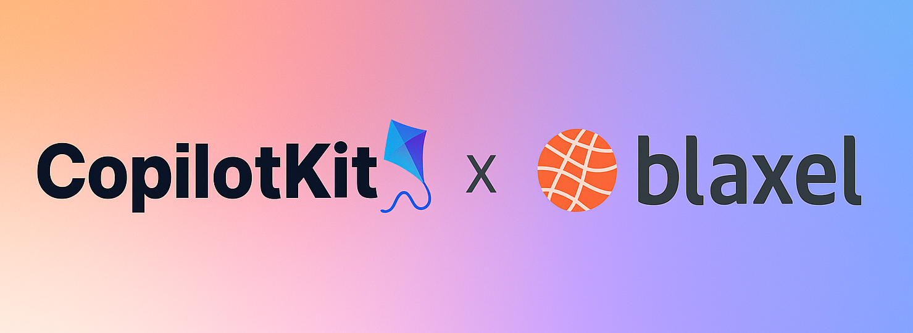

# CopilotKit X Blaxel - Trip Booking Agent

<p align="center">
  
</p>

A multi‑agent conversational assistant for booking flights and hotels, built with LangGraph, CrewAI, and the Blaxel platform. It orchestrates specialized sub‑agents and integrates web scraping, search, and summarization tools for end‑to‑end trip booking workflows.
Blaxel integrates seamlessly with CopilotKit, allowing you to deploy sophisticated AI agents to your customers within seconds. This powerful combination enables rapid delivery of conversational assistants with minimal setup time.

## Features

- Supervisor agent to delegate booking tasks
- Flight Agent (CrewAI) for flight search and provider lookup
- Hotel Agent (LangGraph REACT) for hotel search and Q&A
- Explorer‑MCP microservice for scraping and URL generation
- Streaming responses via CopilotKit endpoint
- Easily deployable to Blaxel Platform

## Prerequisites

- **Python:** 3.10 or later
- **[UV](https://github.com/astral-sh/uv):** An extremely fast Python package and project manager, written in Rust
- **[Blaxel CLI](https://docs.blaxel.ai/Get-started):** Ensure you have the Blaxel CLI installed. If not, install it globally:
  ```bash
  curl -fsSL https://raw.githubusercontent.com/blaxel-ai/toolkit/main/install.sh | BINDIR=$HOME/.local/bin sh
  ```
- **Blaxel login:** Login to Blaxel platform
  ```bash
  bl login YOUR-WORKSPACE
  ```
- **Browserbase API KEY** [Settings](https://www.browserbase.com/settings)
  Create a `.env` file in directory explorer-mcp and set:
  ```bash
  # Your Browserbase API key for headless browsing
  BROWSERBASE_API_KEY=your_api_key_here
  ```

## Installation

**Clone the repository and install dependencies:**

```bash
git clone https://github.com/blaxel-ai/template-copilot-kit-py.git
cd template-copilot-kit-py
uv sync
```

## Running the Root Service Locally

Start the root supervisor service with hot reloading:

```bash
bl serve --hotreload
```

_Note:_ This command starts the server and enables hot reload so that changes to the source code are automatically reflected.

## Running the Explorer-MCP Microservice

In a separate terminal, start the flight data service for scraping and URL tools:

```bash
cd explorer-mcp
BL_DEBUG=true uv run mcp dev src/server.py
```

## Testing the Agent

You can test the booking assistant using the chat interface:

```bash
bl chat --local blaxel-agent
```

Or run it directly with specific input:

```bash
bl run agent blaxel-agent --local --data '{"input": "What is the weather in Paris?"}'
```

## Deploying to Blaxel

When you are ready to deploy your application:

```bash
bl deploy
```

This command uses your code and the configuration files under the `.blaxel` directory to deploy your application.

## Project Structure

- **src/main.py** - Application entry point
- **src/agent.py** - Core agent implementation with LangGraph integration
- **src/server/** - Server implementation and routing
- **pyproject.toml** - UV package manager configuration
- **blaxel.toml** - Blaxel deployment configuration

## License

This project is licensed under the MIT License. See the [LICENSE](LICENSE) file for more details.
